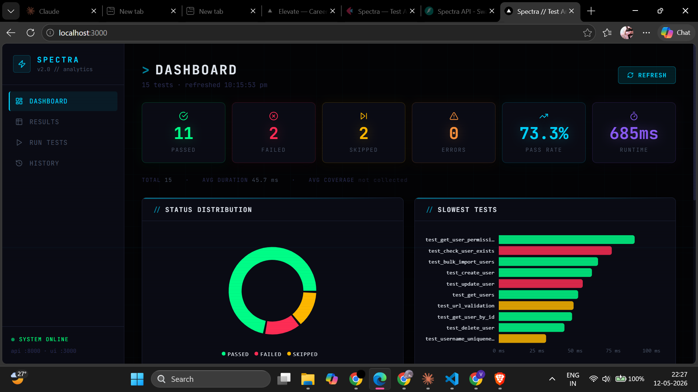

# ⚡ Spectra

> Cybersec-grade test analytics platform — visualise, run, and track your pytest results in a sleek dark-mode dashboard.



---

## Features

- **Dashboard** — 6 live stat cards (Passed, Failed, Skipped, Errors, Pass Rate, Runtime), status donut chart, slowest-tests bar chart, pass/fail-by-file trend, coverage-by-file chart, per-file breakdown table
- **Results** — Sortable & filterable table, import JUnit XML / JSON, export CSV / JSON, inline delete, add tests manually with duplicate detection
- **Run Tests** — Point at any project folder, hit Run, watch pytest stream live in a terminal-style output. Optional coverage mode (pytest-cov)
- **History** — Save named sessions, load them back any time, compare runs over time

---

## Tech Stack

| Layer | Tech |
|---|---|
| Frontend | Next.js 14, React 18, Tailwind CSS, Recharts |
| Backend | FastAPI, Uvicorn, Python 3.10+ |
| Testing | pytest, pytest-cov, JUnit XML |

---

## Getting Started

### 1. Clone

```bash
git clone https://github.com/V21-vani/Spectra.git
cd Spectra
```

### 2. Backend

```bash
cd api
pip install -r requirements.txt
python -m uvicorn main:app --port 8000
```

### 3. Frontend

```bash
cd frontend
npm install
npm run dev
```

Open **http://localhost:3000**

> The API runs on `:8000` and the UI on `:3000`. Both must be running.

---

## Project Structure

```
Spectra/
├── api/                  # FastAPI backend
│   ├── main.py           # All endpoints + WebSocket runner
│   └── requirements.txt
├── frontend/             # Next.js app
│   └── src/
│       ├── app/          # Dashboard, Results, Run, History pages
│       ├── components/   # GlowCard, StatCard, StatusBadge, charts
│       └── lib/          # API client, TypeScript types
├── src/                  # Shared Python core
│   ├── models.py         # TestResult, TestSession dataclasses
│   ├── parser.py         # JUnit XML parser
│   ├── runner.py         # pytest runner + coverage integration
│   └── storage.py        # JSON session persistence
└── storage/              # Saved sessions (runtime, gitignored)
```

---

## Coverage Support

Enable the **Coverage** toggle in the Run Tests view. Requires `pytest-cov`:

```bash
pip install pytest-cov
```

Coverage percentages are automatically mapped from source files to test results and visualised in the Coverage by File chart on the Dashboard.

---

## License

MIT
